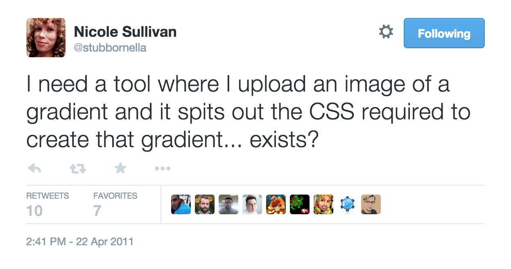

pngtocss takes in a png file with a gradient in it and spits out the necessary CSS to
draw that gradient.

## It only works with:

*  24 bit PNGs
*  only linear gradients
*  horizontal gradients
*  vertical gradients
*  diagonal gradients
*  multi-colour support only for horizontal and vertical

## It does not support:

*  radial gradients
*  angular gradients (except for perfect diagonal)
*  more than 2 colours on diagonal gradients

## Code

See the examples/ directory for all the pngs that I've tested this with.  Feel free
to submit your own (keep them small).

See the src/ directory for the source code.

It's written in C, and uses libpng 1.6.21 and zlib 1.2.8. You'll need both of those to compile it.
Also, I wrote it on MacOSX, so I installed the libraries using ports.  You may need to
play with the Makefile if you're using a different OS.  Sorry, I don't have the time 
to test, but if you submit a pull request, I'll merge it.

It has also been tested to work with the current latest beta version of libpng17 (1.7.0beta78). You can find the Portfile in the ports/graphics/libpng/ directory to help you install it with MacPorts if you are on MacOSX.

## License:

BSD Licensed

## Copyright:

2011 Philip Tellis -- <philip@bluesmoon.info> -- http://bluesmoon.info/

## Credits:

Everything I know about reading a PNG I got from Chapter 13 of the libpng book: 
http://www.libpng.org/pub/png/book/chapter13.html

The CSS gradient syntax came from these wonderful sites:

*  http://css-tricks.com/css3-gradients/
*  http://webdesignerwall.com/tutorials/cross-browser-css-gradient
*  http://hacks.mozilla.org/2009/11/css-gradients-firefox-36/
*  http://www.tankedup-imaging.com/css_dev/css-gradient.html

## History:

Nicole tweeted about [the absence of a tool to convert images to gradients](http://twitter.com/stubbornella/status/61499795801505792/):

I realised that I knew neither what CSS gradients were, nor how to read a PNG file, so
figured that this was a good opportunity to learn both at once.  I decided to write it
in C because I hadn't written C code in a very long time.

Patches welcome.

## Things I learnt

*  The average of two colours will be closer to one than to the other.

## Discussion

Talk about pngtocss on the [discussion page](http://bluesmoon.github.com/pngtocss/)
